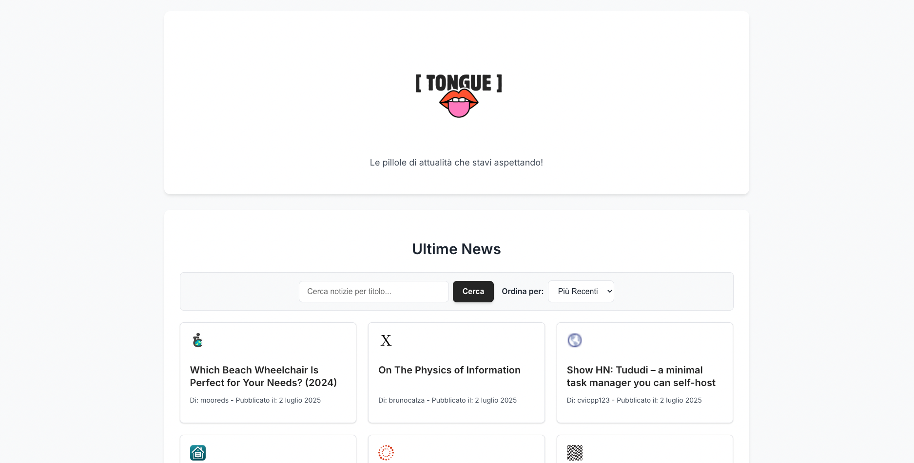

Tongue - Aggregatore di Notizie Tech

Un aggregatore di notizie web moderno e reattivo, sviluppato come progetto di Master, che ti tiene aggiornato sulle ultime novità dal mondo della tecnologia, attingendo direttamente da Hacker News. È stato concepito per soddisfare i requisiti di una consegna per il Master, dimostrando una solida comprensione delle fondamenta dello sviluppo web front-end e l'implementazione di funzionalità avanzate.

🚀 Demo Live
Link alla Demo Live su Netlify <!--  LINK  -->

📸 Screenshot dell'Applicazione

💡 Introduzione
Tongue è un'applicazione web monopagina (SPA) progettata per fornire un'esperienza utente pulita e intuitiva nella consultazione delle notizie tecnologiche. Il suo scopo è aggregare gli articoli più recenti e rilevanti da Hacker News, offrendo strumenti di filtraggio e ordinamento per una navigazione personalizzata. Particolare attenzione è stata dedicata alla reattività, all'accessibilità e all'estetica, integrando un sistema di feedback visivi e una gestione efficiente dei dati.

✨ Funzionalità Implementate
Funzionalità Core (Requisiti Principali)
Caricamento e Visualizzazione Notizie: Recupera e presenta le ultime notizie da Hacker News in una griglia dinamica e leggibile.

Paginazione "Carica altro": Gestisce il caricamento di grandi volumi di notizie in blocchi incrementali (10 per volta), migliorando le performance e l'esperienza utente senza sovraccaricare la pagina.

Interfaccia Dinamica (Manipolazione DOM): Tutti gli elementi dell'interfaccia utente (display delle notizie, pulsanti, input di ricerca, selettore di ordinamento) sono generati e gestiti dinamicamente tramite JavaScript puro.

JavaScript Puro: L'intero progetto è sviluppato senza l'ausilio di librerie o framework JavaScript esterni (es. jQuery, React, Angular, Vue), in piena conformità con le specifiche del brief.

Design Responsivo: L'interfaccia si adatta perfettamente a diverse dimensioni di schermo, dai desktop ai dispositivi mobili, garantendo un'esperienza utente consistente.

Funzionalità Avanzate Aggiuntive
Favicon per le Fonti: Ogni card di notizia visualizza il favicon del sito di origine dell'articolo. Questo fornisce un'identificazione visiva immediata della fonte e un tocco professionale.

Dettagli Autore e Data: Sotto il titolo di ogni notizia, sono visibili il nome dell'autore (se disponibile dall'API) e la data esatta di pubblicazione, arricchendo il contesto informativo.

Ricerca per Titolo: Un campo di input dedicato permette all'utente di filtrare le notizie in base a parole chiave presenti nel titolo. La logica di ricerca è implementata con una funzione di debounce per ottimizzare la reattività e le performance, evitando ricerche continue ad ogni singola digitazione.

Opzioni di Ordinamento: Un selettore permette all'utente di scegliere l'ordinamento delle notizie. Sono disponibili le opzioni "Più Recenti" (l'ordinamento predefinito per data) e "Punteggio" (basato sulla popolarità dell'articolo su Hacker News).

Favicon Multi-dispositivo: Supporto completo per la visualizzazione del favicon su una vasta gamma di piattaforme, inclusi browser desktop (schede, segnalibri) e dispositivi mobili (icone per la schermata Home su iOS/Android), assicurando un'identità visiva coerente.

🛠️ Tecnologie Utilizzate
Frontend:

HTML5: Per la struttura semantica e l'organizzazione della pagina web.

CSS3: Per la stilizzazione, il layout responsivo e la definizione dei colori dinamici.

JavaScript (ES6+): Il motore dell'applicazione, responsabile della logica, della manipolazione del DOM, della gestione degli eventi e di tutte le funzionalità.

API:

Hacker News API: La fonte principale dei dati delle notizie.

Google Favicon API: Utilizzata per il recupero dei favicon dei siti di origine.

Strumenti di Sviluppo:

Node.js: Ambiente di runtime JavaScript.

npm: Gestore di pacchetti per le dipendenze del progetto.

Webpack: Module bundler per ottimizzare e impacchettare il codice JavaScript e CSS.

Axios: Client HTTP basato su Promise per effettuare richieste API in modo efficiente.

📂 Struttura del Progetto
Il progetto è organizzato in una struttura di directory chiara e modulare, seguendo le migliori pratiche per la manutenibilità e la scalabilità del codice:

.
├── public/                     # Contiene tutti i file che verranno serviti direttamente dal browser.
│   ├── index.html              # Il file HTML principale dell'applicazione.
│   ├── css/                    # Cartella dedicata ai fogli di stile.
│   │   └── style.css           # Stili CSS globali e specifici dell'applicazione.
│   ├── js/                     # Cartella dedicata agli script JavaScript.
│   │   ├── app.js              # Il file JavaScript principale che inizializza l'applicazione e gestisce la logica di alto livello.
│   │   ├── api.js              # Gestisce tutte le interazioni con le API di Hacker News e il recupero dei favicon.
│   │   ├── ui.js               # Contiene le funzioni responsabili della manipolazione del DOM e dell'aggiornamento dell'interfaccia utente.
│   │   └── utils.js            # Contiene funzioni di utilità generiche (es. formattazione data, debounce).
│   └── img/                    # Cartella per immagini (logo, favicon).
│       ├── logo.png            # Il logo dell'applicazione.
│       ├── favicon.ico         # Favicon tradizionale.
│       ├── favicon-16x16.png   # Favicon 16x16.
│       ├── favicon-32x32.png   # Favicon 32x32.
│       ├── apple-touch-icon.png # Icona per dispositivi Apple.
│       ├── android-chrome-192x192.png # Icona per Android (192px).
│       ├── android-chrome-512x512.png # Icona per Android (512px).
│       └── site.webmanifest    # Manifest per Progressive Web App (PWA).
├── screenshots/                # Cartella dedicata agli screenshot dell'applicazione.
│   └── screenshot-tongue-main.png # 
├── webpack.config.js           # Il file di configurazione per Webpack.
├── package.json                # Definisce le dipendenze del progetto e gli script di avvio/build.
├── package-lock.json           # Generato automaticamente da npm, blocca le versioni delle dipendenze.
├── .env                        # File per le variabili d'ambiente.
├── .gitignore                  # Specifica i file e le cartelle da ignorare dal controllo versione di Git.
└── README.md                   # Questo file, contenente la descrizione del progetto.

⚙️ Come Avviare il Progetto in Locale
Segui questi passaggi per configurare ed eseguire il progetto sulla tua macchina locale.

Prerequisiti
Assicurati di avere installato Node.js (che include npm).

Installazione
Clona il repository (se non lo hai già fatto):

git clone  # (https://github.com/erikarossi95/tongue-news-app.git)
cd tongue-news-app

Installa le dipendenze del progetto:

npm install

Esecuzione
Avvia il server di sviluppo:

npm start

L'applicazione sarà disponibile su http://localhost:8080 (o una porta simile).

Build per la Produzione
Per creare una versione ottimizzata per il deployment:

npm run build

Questo genererà i file ottimizzati nella cartella dist/.

🌐 Deployment
Questa applicazione è stata progettata per un facile deployment su piattaforme di hosting statico. È stata testata e può essere facilmente messa online utilizzando servizi come Netlify. Basta caricare il contenuto della cartella dist/.

🚧 Sfide e Soluzioni
Una delle sfide principali è stata l'integrazione di immagini contestuali per ogni articolo. A causa delle restrizioni di sicurezza del browser (come la Same-Origin Policy e le politiche CORS), l'estrazione diretta e automatica di immagini da domini esterni arbitrari è complessa e spesso bloccata.

Soluzione adottata: Ho optato per l'integrazione dei favicon delle fonti. Questa soluzione offre un'identificazione visiva efficace e affidabile, aggirando le problematiche di sicurezza senza compromettere la funzionalità o l'esperienza utente.

🗺️ Roadmap Futura
Funzionalità di Salvataggio/Preferiti: Permettere agli utenti di salvare le notizie per leggerle in seguito.

Notifiche: Implementare notifiche per nuove notizie su argomenti di interesse.

Modalità Scura: Aggiungere un'opzione per una modalità di visualizzazione scura.

Filtri Avanzati: Introdurre filtri per data, autore o categoria.

Test Unitari e di Integrazione: Migliorare la copertura dei test per garantire la robustezza del codice.

🧑‍💻 Autore Erika Rossi

📄 Licenza
Questo progetto è rilasciato sotto licenza MIT.

🙏 Ringraziamenti
Un ringraziamento speciale a:

Hacker News API per aver fornito i dati.

Google Favicon Service per il recupero dei favicon.